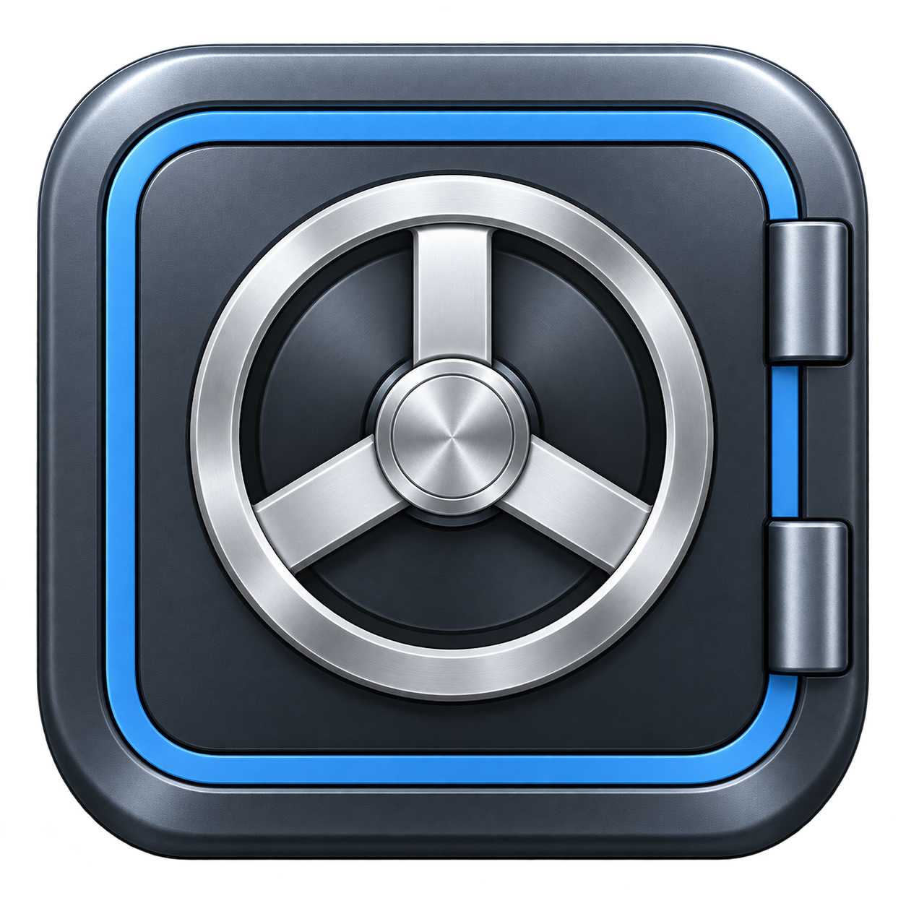
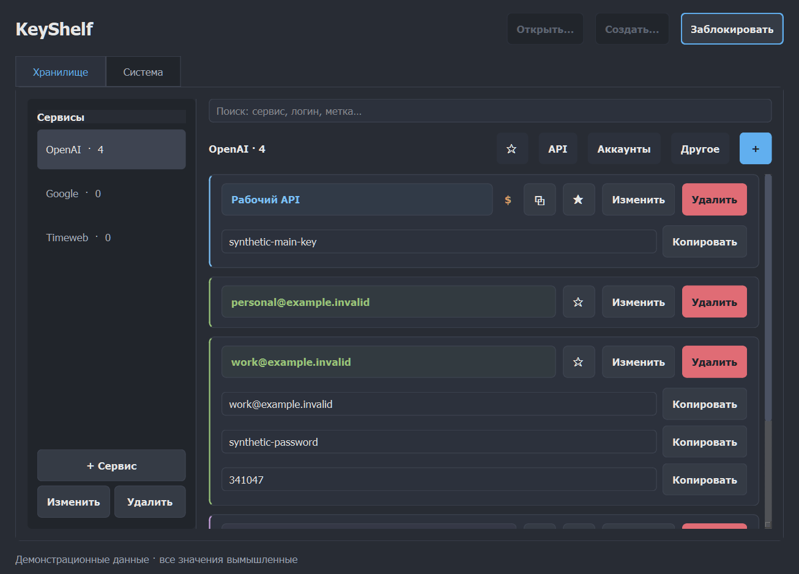
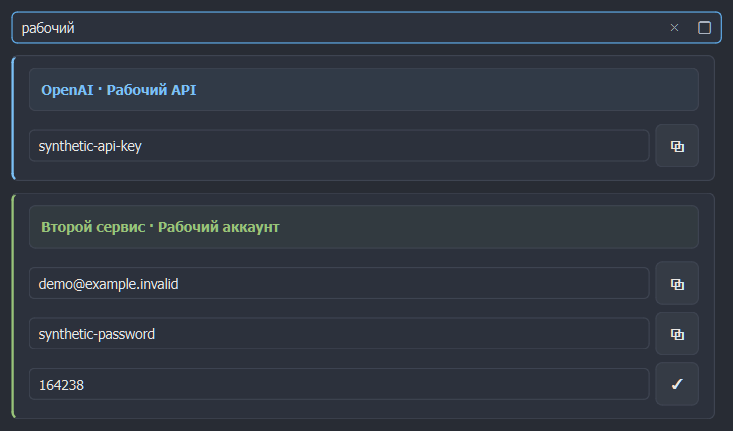

<p align="center"></p>
<h1 align="center">KeyShelf</h1>

<p align="center">Локальное зашифрованное хранилище ключей и аккаунтов.</p>
<p align="center"><a href="README.en.md">English</a> · <a href="https://github.com/Frommer-droid/KeyShelf/releases/latest">Последний релиз</a></p>

Локальное хранилище API-ключей, аккаунтов и других данных для Windows 10/11 x64. Сервисы слева, записи справа. Все данные сохраняются в зашифрованном файле KDBX4.



## Установка и первый запуск

Скачайте установщик со [страницы последнего релиза KeyShelf](https://github.com/Frommer-droid/KeyShelf/releases/latest) или откройте `KeyShelf.exe` в переносной папке. Пока репозиторий приватный, скачивание доступно только пользователям с доступом к нему. Python для готовой сборки не требуется. Переносите папку целиком вместе с `_internal`.

1. Нажмите **Создать…**, выберите файл вне папки приложения и задайте мастер-пароль длиной от 12 символов. Существующий файл открывается через **Открыть…**.
2. Добавьте сервис, нажмите синюю кнопку **+** и выберите тип. У API есть метка, ключ, признак платного API и комментарий. У аккаунта — метка, логин, пароль, постоянный секрет 2FA и комментарий. У «Другого» — метка, три произвольных поля и комментарий.
3. Нажмите карточку для просмотра. Показываются только заполненные значения с кнопками копирования. Ключи и пароли видны открыто. Комментарий и постоянный секрет 2FA доступны в редакторе. Для API и «Другого» миниатюрная кнопка копирует первое поле без раскрытия; успешное копирование временно меняет иконку на галочку.

Мастер-пароль восстановить нельзя. Сохраняйте резервные копии отдельно от компьютера.

В редакторе каждого типа кнопки **+** и **−** находятся слева внизу. Выберите поле значений курсором: **+** вставит пустое поле под ним, **−** удалит выбранное поле вместе с текстом. Без выбранного поля **+** добавляет поле в конец, а **−** недоступна. Тип, метка и комментарий остаются служебными элементами. Порядок полей сохраняется в хранилище и JSON; заполненные доступны в карточке с копированием.

Тип можно изменить в выпадающем списке и у существующей записи. Значения видимых строк переносятся по порядку в стандартные поля нового типа, а оставшиеся — в дополнительные. Повторное переключение переносит текущие значения; отдельных черновиков по типам нет. Метка, комментарий и избранное сохраняются. При выборе «Аккаунта» значение в поле 2FA должно быть корректным секретом TOTP или пустым.

При наведении кнопка избранного показывает заполненную звезду и оформление выбранной кнопки. Наведение не меняет признак избранного — для этого нажмите кнопку.

В **Системе → Масштаб интерфейса** можно выбрать поправку от 50% до 150%. Значение 100% оставляет автоматический масштаб экрана без поправки. Размеры элементов, шрифты и диалоги меняются вместе; выбор сохраняется после перезапуска.

## Поиск, фильтры и 2FA

Поиск охватывает все сервисы: название сервиса, метку, логин и названия полей. Значения полей и комментарии не индексируются. Выбор сервиса слева очищает поиск.

Фильтры API, «Аккаунты» и «Другое» показывают выбранные типы вместе; если все выключены, показываются все типы. Выбор типов запоминается отдельно для каждого сервиса и сохраняется после перезапуска. Звезда включает только избранные. Типы отличаются мягкими цветами. `$` обозначает платный API, зелёный `⓪` — бесплатный.

Короткий 2FA-код рассчитывается локально из Base32 или ссылки `otpauth://totp/`; нужно точное системное время. Приложение не проверяет ключи через API провайдера.

## Мини-режим

Кнопка **Мини** справа в верхнем ряду переключает окно в компактный поиск по всему хранилищу. При пустом запросе видна только строка поиска. Найденные записи появляются ниже, раскрываются нажатием на заголовок и позволяют копировать значения квадратными кнопками; галочка подтверждает копирование. Длинный список прокручивается. Фильтры типов и избранного из большого окна не ограничивают этот поиск.



Кнопка справа внутри строки поиска возвращает **Макси**. Режим, размер и положение двух вариантов окна сохраняются отдельно. После перезапуска откройте хранилище: затем восстановится выбранный режим. Запрос хранится только в текущей сессии; глобальная горячая клавиша пока не назначена.

## Трей и автозагрузка

При доступном системном лотке крестик прячет окно в трей в любом режиме, включая экран открытия хранилища. Щелчок по иконке возвращает тот же режим и текущую сессию без повторного пароля; запрос и раскрытые карточки сохраняются. В мини поиск получает фокус, а прежний запрос выделяется для замены. **Выход** завершает приложение; следующий запуск снова требует пароль.

В **Системе** доступны запуск при входе текущего пользователя Windows и запуск свёрнутым. Стартовое окно показывает десять последних успешно открытых хранилищ; сохраняются только пути. **Заблокировать** закрывает сессию вручную. Автоблокировки по бездействию нет.

## Импорт, экспорт и копии

JSON-импорт добавляет сервисы и записи, пропускает точные повторы и сохраняет существующие данные. Экспортирует всё хранилище или выбранный сервис. **JSON содержит ключи и пароли в открытом виде.** [Формат обмена](docs/import-export.md).

Перед изменением предыдущая зашифрованная версия сохраняется рядом как `.kdbx.bak`. В **Системе** можно сохранить отдельную зашифрованную копию и открыть резервную. JSON не переносит историю и вложения KDBX; для них нужна зашифрованная копия.

## Хранение и ограничения

KDBX4 использует AES-256 и Argon2id (64 МиБ, три прохода, два потока). Пароль остаётся в памяти сессии. Блокировка и выход очищают интерфейс и принадлежащий приложению буфер; чужой новый текст не удаляется. Таймера очистки нет. Приложение просит Windows исключить значения из истории и облачного буфера, но сторонние менеджеры могут сохранять копии. Гарантированное обнуление памяти Python и Qt не обеспечивается.

Настройки хранятся рядом с приложением в `settings.json`, без ключей и мастер-пароля. Хранилище выбирается отдельно. Изменения другими программами обнаруживаются; сетевые файловые системы отдельно не проверялись.

Удаление через установщик убирает установленные файлы приложения и сохраняет созданные пользователем настройки, логи и хранилища. Резервные копии хранилищ всё равно храните отдельно.

## Запуск из исходников

Требуется Python 3.12 для Windows:

```powershell
py -3.12 -m venv .venv
.\.venv\Scripts\python.exe -m pip install -r requirements.txt
```

Затем откройте `Запустить.cmd` в корне проекта. Проверки и сборка: [DEVELOPER.md](DEVELOPER.md).

## Лицензия

Версия 0.3.0. [GPL-3.0](LICENSE). Проект использует PyKeePass под GPL-3.0; лицензии сторонних компонентов сохраняются. Исходники и сборочные скрипты включены в `source` готовой сборки. [Лицензии зависимостей](THIRD_PARTY_NOTICES.md), [доступ к исходникам](SOURCE_CODE_ACCESS.md), [Qt/PySide6](QT_PYSIDE6_COMPLIANCE.md).
